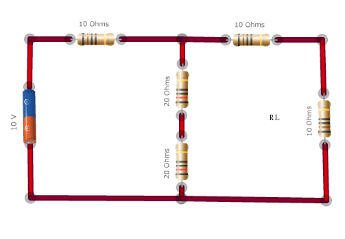
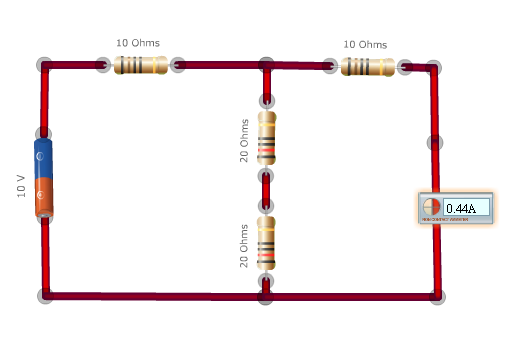
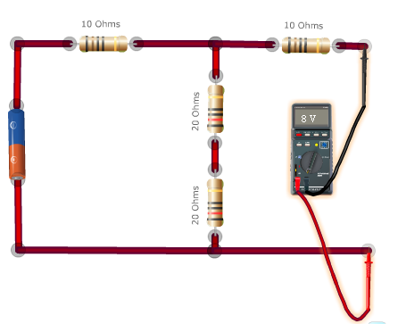
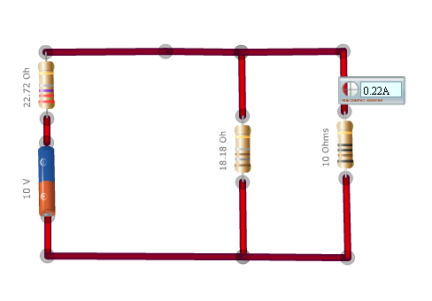

### Procedure
### Apparatus:
 

 Resistors, Battery, connection wire etc..

<h3>Procedure:</h3>

<ol>
  <li>Make an electric network using specific resistors and voltage sources.</li>
  <li>Determine the current through the load resistance in the original circuit using an ammeter.</li>
  <li>Determine the equivalent Norton current <strong>INO</strong> and Norton resistance <strong>RNO</strong>.</li>
</ol>

<h4>Steps to find Norton equivalent resistance RNO and current INO:</h4>

<ol type="a">
  <li>Calculate the output current for zero load resistance. This gives <strong>INO</strong>.</li>
  <li>Calculate the output voltage <strong>V</strong> for infinite load resistance (i.e., under open circuit condition).</li>
  <li><strong>RNO</strong> equals <strong>V</strong> divided by <strong>INO</strong>.</li>
</ol>

<strong>An example for Norton equivalent circuit</strong>

<strong>Step 1:</strong> Original circuit.

<strong>Step 2:</strong> Calculating Norton equivalent current.

<strong>Step 3:</strong> Calculating the Norton equivalent resistance.

<strong>RNO</strong> = V / INO = 8 / 0.44 = <strong>18.18 Ω</strong>

Now the Norton equivalent circuit is given by.

<ol start="4">
 <li>To make a current source, connect a suitable resistance in series with a voltage source as shown in the last picture.</li>
  <li>Construct the Norton equivalent circuit and hence find the load current.</li>
  <li>Show that in both cases the load currents are equal, hence verify that Norton's theorem is correct.</li>
</ol>

<h3>Components:</h3>

<ul>
  <li><strong>Resistor:</strong> A resistor is a two-terminal electronic component that produces a voltage across its terminals that is proportional to the electric current through it in accordance with Ohm's law.</li>
  <li><strong>Lamp:</strong> A lamp is a replaceable component such as an incandescent light bulb, which is designed to produce light from electricity. These components usually have a base of ceramic, metal, glass, or plastic, which makes an electrical connection in the socket of a light fixture.</li>
  <li><strong>Wire:</strong> A wire is a single, usually cylindrical, elongated string of metal. Wires are used to bear mechanical loads and to carry electricity and telecommunications signals. Wire is commonly formed by drawing the metal through a hole in a die or draw plate.</li>
  <li><strong>Switch:</strong> In electronics, a switch is an electrical component that can break an electrical circuit, interrupting the current or diverting it from one conductor to another.</li>
  <li><strong>Battery:</strong> A battery or voltaic cell is a combination of many electrochemical Galvanic cells of identical type to store chemical energy and to deliver higher voltage or higher current than with single cells.</li>
  <li><strong>Voltmeter:</strong> A voltmeter is an instrument used for measuring the electrical potential difference between two points in an electric circuit. Analog voltmeters move a pointer across a scale in proportion to the voltage of the circuit; digital voltmeters give a numerical display of voltage by use of an analog to digital converter.</li>
  <li><strong>Ammeter:</strong> An ammeter is a measuring instrument used to measure the electric current in a circuit. Electric currents are measured in amperes (A), hence the name.</li>
  <li><strong>Non-contact ammeter:</strong> A type of ammeter that need not be a part of the circuit.</li>
</ul>

