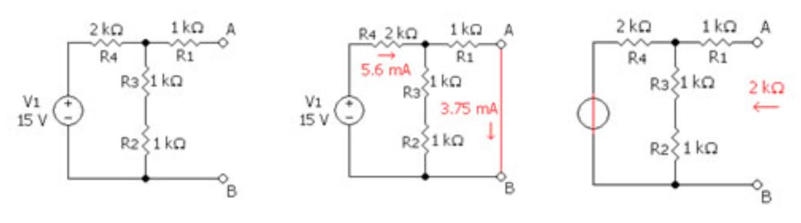
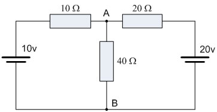
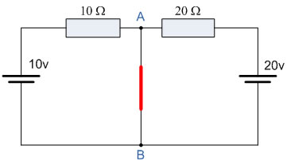
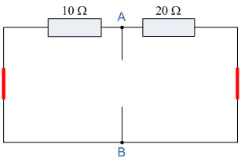
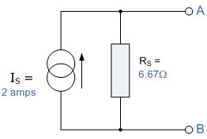
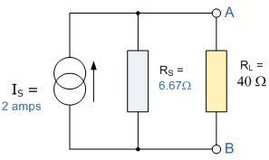
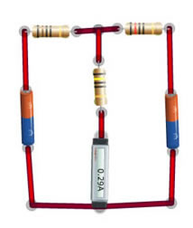
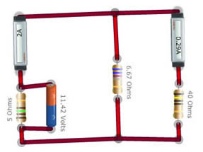

## Theory 

<strong>Norton's Theorem:</strong>

Norton's theorem states that a network consisting of several voltage sources, current sources, and resistors with two terminals is electrically equivalent to an ideal current source <strong>INO</strong> and a single parallel resistor <strong>RNO</strong>. The theorem can be applied to both A.C. and D.C. cases.

The Norton equivalent of a circuit consists of an ideal current source in parallel with an ideal impedance (or resistor for non-reactive circuits).

<strong>Norton Equivalent Circuit:</strong>

The Norton equivalent circuit is a current source with current <strong>INO</strong> in parallel with a resistance <strong>RNO</strong>. To find its Norton equivalent circuit:

<ol>
  <li><strong>Find the Norton current (INO):</strong> 
      Calculate the output current, <strong>IAB</strong>, when a short circuit is the load (i.e., 0 resistance between A and B). This current is INO.
  </li>

  <li><strong>Find the Norton resistance (RNO):</strong> 
    If there are no dependent sources, you can use one of the following methods:
    <ul>
      <li>Calculate the output voltage, <strong>VAB</strong>, under open circuit condition (no load connected). Then, <strong>RNO = VAB / INO</strong>.</li>
      <li>Replace independent voltage sources with short circuits and independent current sources with open circuits. Then calculate the resistance seen at the output terminals; this is <strong>RNO</strong>.</li>
    </ul>
  </li>

  <li><strong>When dependent sources are present:</strong> 
    Use the general method:
    <ul>
      <li>Connect a 1 Ampere constant current source across the output terminals.</li>
      <li>Calculate the resulting voltage across this source.</li>
      <li>The Norton resistance is <strong>RNO = V / 1 A</strong>.</li>
      <li>This method is valid for all circuits and is required when dependent sources exist.</li>
    </ul>
  </li>
</ol>

<strong>Example 1:</strong>

Consider this circuit –

To find the <strong>Norton’s equivalent</strong> of the above circuit, we first remove the center 40Ω load resistor and short the terminals A and B. This gives us the following circuit:

When the terminals A and B are shorted together, the two resistors are connected in parallel across their respective voltage sources. The currents flowing through each resistor, as well as the total short-circuit current, can now be calculated as:

$$I_1 = \frac{10\,\mathrm{V}}{100\,\Omega} = 1\mathrm{A}, \quad I_2 = \frac{20\,\mathrm{V}}{200\,\Omega} = 1\mathrm{A}$$  

therefore, 

$$I_{\text{short-circuit}} = I_1 + I_2 = 2\mathrm{A}$$  

If we short out the two voltage sources and open circuit terminals A and B, the two resistors are now effectively connected together in parallel. The value of the internal resistor <strong>RS</strong> is found by calculating the total resistance at the terminals A and B, giving us the following circuit:

<strong>Find the Equivalent Resistance (RS):</strong>

10Ω resistor in parallel with the 20Ω resistor.

$$R_T = \frac{R_1 \times R_2}{R_1 + R_2} = \frac{20 \times 10}{20 + 10} = 6.67\,\Omega$$

Having found both the short-circuit current, <strong>IS</strong>, and the equivalent internal resistance, <strong>RS</strong>, this gives us the following Norton's equivalent circuit:

#### Nortons equivalent circuit.

Ok, so far so good, but we now have to solve with the original 40Ω load resistor connected across terminals A and B, as shown below.

Again, the two resistors are connected in parallel across the terminals A and B, which gives us a total resistance of:

$$R_T = \frac{R_1 \times R_2}{R_1 + R_2} = \frac{6.67 \times 40}{6.67 + 40} = 5.72\Omega$$

The voltage across the terminals A and B with the load resistor connected is given as:

$$V_{y\text{-}g} = 1 \times R = 2 \times 5.72 = 11.44\mathrm{V}$$

Then the current flowing in the 40Ω load resistor can be found as:

$$I = \frac{V}{R} = \frac{11.44\,\mathrm{V}}{40\,\Omega} = 0.29\,\mathrm{A}$$

<strong>Verification of Norton’s Theorem using the simulator:</strong>

<strong>Step 1:</strong> Create the actual circuit and measure the current across the load points.

<strong>Step 2:</strong> Create the Norton’s equivalent circuit by first creating a current source of the required equivalent current in amperes (2 A in this case), and then measure the current across the load using an ammeter.

In both cases, the current measured across the resistance should be the same.

<h3>More about Norton’s Theorem:</h3>

<ol>
  <li>Norton’s theorem and Thevenin’s theorem are equivalent, and this equivalence leads to source transformation in electrical circuits.</li>
  <li>For an electric circuit, the equivalence is given by:  
    <code>VTh = INo × RTh</code>  
    i.e., Thevenin’s voltage = Norton’s current × Thevenin’s resistance
  </li>
  <li>The applications of Norton’s theorem are similar to those of Thevenin’s theorem. The main application is the simplification of electrical circuits using source transformation.</li>
</ol>

